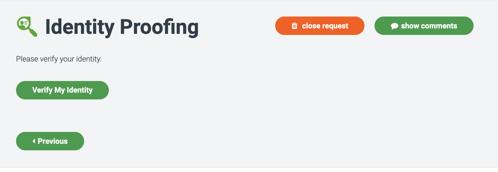

# Identity Proofing User Guide

## SecZetta Identity Proofing

As enterprise organizations increasingly grant access to facilities, data, and systems to an ever-expanding number of third-party users, it becomes imperative for them to prove that these people are in fact who they claim to be.  

### IDProofing

With SecZetta’s IDProofing it’s possible to easily invoke large scale or individual identity verification during the onboarding process or at any time throughout the identity lifecycle. 

### Goal of the Document

This document is designed to familiarize users with IDProofing features and functionality.

## Understanding the Tool

IDProofing can be configured to leverage mobile carrier records or the combination of a government issued photo ID (see below) and a live selfie to confirm that users are who they claim to be.  When enabled, IDProofing shows as an action within the Third-Party Identity Risk workflow engine.  A user may be prompted to prove their identity during onboarding or at any point during their lifecycle.  

## Before Using the System

There are two available methods of ID Proofing withing SecZetta: **Mobile Match** and **Government ID Verification**. Before you begin using IDProofing, please ensure you understand which way you'll be asked to verify your identity and ensure you'll be able to meet system requirements below: 

### SMS Cabable Device 
You will need to confirm receipt of a one time passcode (OTP) that will be sent via SMS.

### Mobile Support - Government ID Verification

Mobile support does not require a special application.  You will need a mobile device with a camera, and access to a mobile browser.  Please see below for further details on compatibility:

|Device Type |OS Version            |Release Date  |
|:-----------|:---------------------|--------------|
|Android	   |5.0 Lollipop or newer |November 2014 |
|iOS	       |12.0 or newer         |September 2018|

### Recommended Browsers - Government ID Verification

|Device Type |Recommended Browser|
|:-----------|-------------------|
|Android     |Chrome             |
|iOS		     |Safari             |

### Supported Document Types - Government ID Verification

Below are the types of documents that can be leveraged to verify user identity details with the Government ID flow.  This service works for roughly 200 countries and 5000 specific types of documents. 

|Document Type           |Supported?|
|:-----------------------|:---------|
|Unknown	               |No        |
|Passport                |Yes       |
|Visa                    |Yes       |
|Drivers License	       |Yes       |
|Identification Card     |Yes       |
|Permit           	     |Yes       |
|Currency	               |No        |
|Residence Document      |No        |
|Travel Document         |Yes       |
|Birth Certificate 	     |No        |
|Vehicle Registration    |No        |
|Other	                 |No        |
|Weapon License          |No        |
|Tribal Identification   |No        |
|Voter Identification    |No        |
|Military	               |Yes       |
|Consular Identification |Yes       |

## Using the System

Identity Proofing will either be initiated as part of an onboarding workflow or you will be contacted to verify your identity by the organization that holds your profile.  Either way, you will be directed to a page within SecZetta where you will select to begin the identity proofing process.

  
There are 3 potential flows that you may encounter once beginning the verification process:

1. Mobile Match
2. Government ID Verification
3. Mobile Match fail over to Government ID Verification

Each will be outlined below.

### Mobile Match

### Government ID Verification

### Mobile Match fail over to Government ID Verification

## Troubleshooting 

